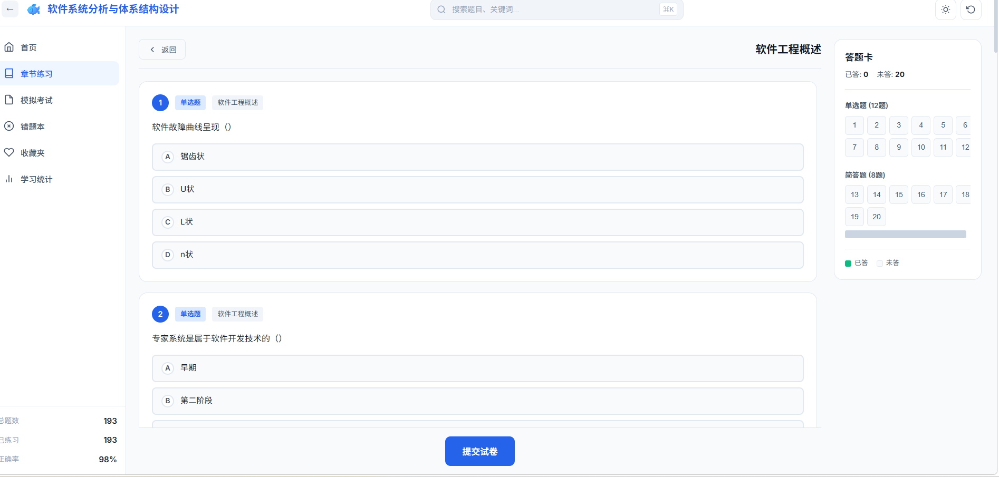
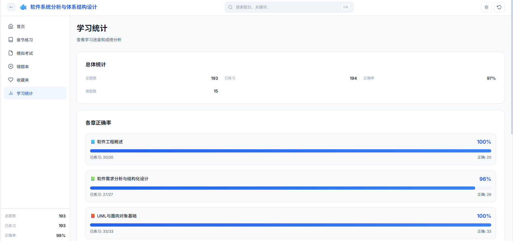

# Exam Quiz System

在线考试刷题系统，支持多科目题库练习。

## 效果展示

| 首页 | 科目首页 | 章节练习 |
|:----:|:-------:|:-------:|
|  |  |  |

| 刷题 | 模拟考试 | 错题本 |
|:----:|:-------:|:-----:|
|  |  |  |

| 学习统计 |
|:-------:|
|  |

## 功能特性

- 多科目切换（软件系统分析、软件项目管理等）
- 按章节练习
- 模拟考试模式
- 错题本与收藏夹
- 答题历史记录
- 响应式设计，支持移动端

## 技术栈

- HTML5 / CSS3 / Vanilla JavaScript
- JSON 数据存储
- LocalStorage 本地持久化

## 项目结构

```
exam-quiz-system/
├── index.html              # 主页面入口
├── software_analysis.html  # 软件系统分析科目页面
├── software_project_management.html  # 软件项目管理科目页面
├── style.css               # 样式文件
├── script.js               # 核心逻辑
├── questions.json          # 软件系统分析题库数据
├── images/                 # 题目相关图片
└── subjects/               # 多科目数据
    ├── registry.json       # 科目注册表
    ├── software_analysis.json
    └── software_project_management.json
```

## 部署方式

直接部署到 GitHub Pages，无需后端服务：

1. Fork 或克隆本仓库
2. 进入仓库 Settings → Pages
3. 选择 `main` 分支，点击 Save
4. 等待部署完成即可访问

## 许可证

MIT
