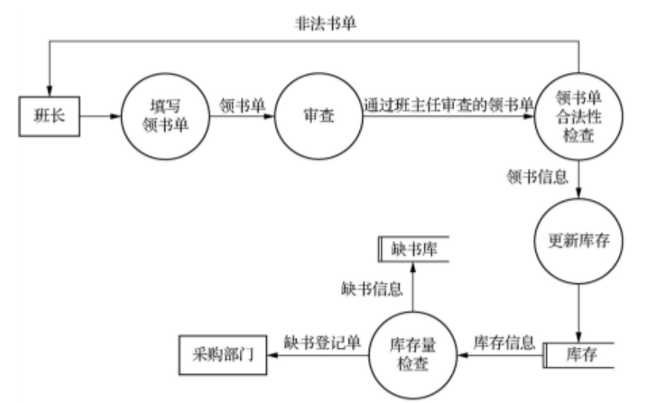
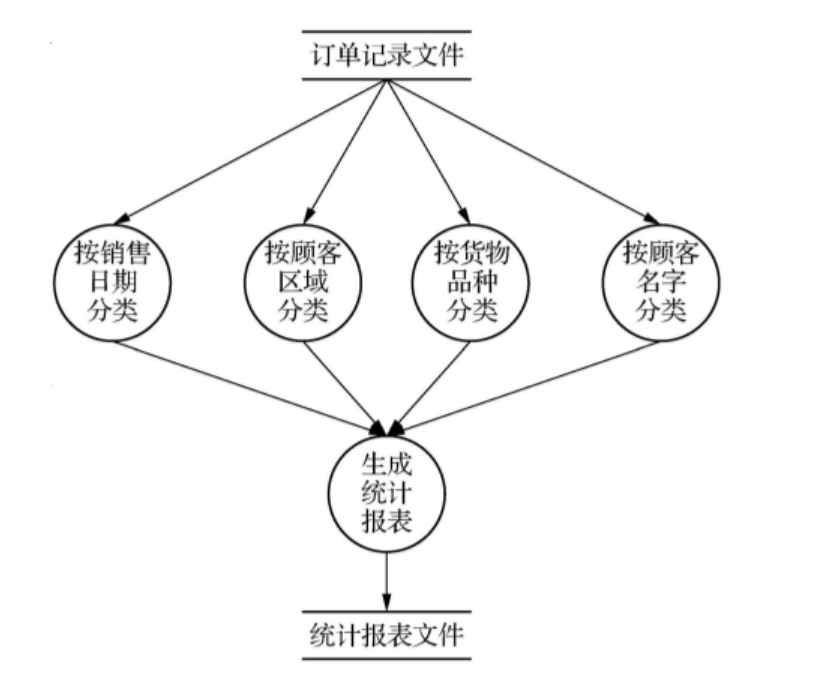

# Chap2 软件需求分析与结构化设计

## 一、单项选择

1. 可行性分析是在需求分析的（ **A** ）  
   A. 需求获取阶段　B. 需求建模阶段  
   C. 需求描述阶段　D. 需求评审阶段

2. 确认测试计划制定是在（ **A** ）  
   A. 需求分析阶段　B. 软件设计阶段  
   C. 软件测试阶段　D. 软件维护阶段

3. 结构化分析方法是面向（ **B** ）  
   A. 过程的　B. 数据流的  
   C. 对象的　D. 数据结构的

4. 数据对象描述是用（ **A** ）  
   A. 实体-关系图　B. 数据流图  
   C. 状态-迁移图　D. SC 图

5. 数据流图的核心是（ **A** ）  
   A. 数据加工　B. 数据源点  
   C. 数据流　D. 数据存储

6. 顶层流图仅包含加工数目为（ **A** ）  
   A. 1 个　B. 2 个  
   C. 3 个　D. 大于 3 个

7. 运用层次化数据流图建模的核心要点在于（ **A** ）  
   A. 父图与子图的平衡　B. 如何分层  
   C. 如何分解　D. 如何抽象

8. 结构化设计中，过程设计来源于结构化分析的（ **A** ）  
   A. 加工规格说明　B. 数据流图  
   C. 数据对象描述　D. 控制规格说明

9. 结构化设计中，接口设计来源于结构化分析的（ **B** ）  
   A. 加工规格说明　B. 数据流图  
   C. 数据对象描述　D. 控制规格说明

10. 结构化分析中的状态迁移图对应于结构化设计的（ **A** ）  
    A. 过程设计　B. 接口设计  
    C. 数据设计　D. 体系结构设计

11. 结构化分析中的实体关系图对应于结构化设计的（ **C** ）  
    A. 过程设计　B. 接口设计  
    C. 数据设计　D. 体系结构设计

12. 应停止模块分解的情况之一是当输入输出设备传送的信息是（ **C** ）  
    A. 模块　B. 流程  
    C. 模块接口　D. 模块调用

13. 可以表示嵌套设计的是（ **C** ）  
    A. 流程图　B. 数据流图  
    C. N-S 图　D. IPO 图

14. 模块设计原则是（ **B** ）  
    A. 高内聚高耦合　B. 高内聚低耦合  
    C. 低内聚高耦合　D. 低内聚低耦合

---

## 二、名词解释

### 1. 功能建模

用抽象模型的概念，按照软件内部数据传递、变换的关系，自顶向下逐层分解，直到找到满足功能要求的所有可实现的软件为止。

### 2. 传出模块

从上级模块获得数据，进行某些处理后将其传送给下属模块。它传送的数据流叫做逻辑输出数据流。

### 3. 传入模块

从下属模块取得数据，进行某些处理后将其传送给上级模块。它传送的数据流叫做逻辑输入数据流。

### 4. 协调模块

对所有下属模块进行协调和管理的模块。

### 5. 变换模块

从上级模块取得数据，进行特定的处理后将其转换成其他形式，再传送回上级模块。

### 6. 流程图

用规定的图形符号和连线表示算法或程序执行过程及控制关系的图形化工具。

### 7. N-S 图

N-S 图也叫盒图，将全部算法写在一个矩形框内，在框内还可以包含其他从属于它的框。

---

## 三、简答

### 1. 简述可行性研究的研究范围

通常从以下几个方面进行：

- 经济可行性
- 技术可行性
- 法律可行性
- 用户操作可行性

### 2. 简述数据流图的组成元素

数据流图（DFD）的组成元素有 4 个：

| 元素 | 含义 |
|---|---|
| 数据加工 / 数据处理 | 对输入的数据进行处理和变换，产生输出数据 |
| 数据流 | 表示数据的流动方向 |
| 数据存储 | 表示数据保存的场所 |
| 数据源点 / 数据终点 / 外部实体 | 表示系统之外的数据来源或数据去向 |

### 3. 简述结构化设计方法实施的步骤

1. 研究、分析和审查数据流图，弄清数据加工过程，发现问题及时解决。
2. 根据数据流图确定数据处理类型：变换型或事务型。
3. 由数据流图推导出系统的初始结构图。
4. 运用启发式原则对初始结构图进行优化和改进。
5. 修改和补充数据字典。
6. 制订测试计划。

### 4. 简述变换型数据处理过程

变换型数据处理过程一般包括三个阶段：

1. **取得数据（输入）**：接收外部输入的数据。
2. **变换数据（中心变换）**：对输入数据进行加工处理。
3. **给出数据（输出）**：将处理结果输出给外部实体或数据存储。

---

## 四、应用题

### 1. 学校领书流程的数据流图

#### 题目

某学校领书的流程如下：

班长填写领书单，经班主任审查后签名，然后班长拿领书单到书库领书。书库保管员审查领书单是否有班主任签名，填写是否正确等情况，不正确的领书单退回给班长；正确则给予领书并修改库存清单。当某书的库存量低于临界值时，登记缺书信息。每天下班前为采购部门提供一张缺书登记单。

#### 数据流图

### 2. 商业销售事务处理统计软件包的数据流图

#### 题目

有一用于商业销售事务处理的统计软件包，其功能要求如下：

1. 根据顾客的订单记录（系统文件）进行各种统计分类，包括：
   - 根据销售日期的分类；
   - 根据顾客区域的分类；
   - 根据货物品种的分类；
   - 根据顾客名字的分类。
2. 生成分类的统计报表。

#### 数据流图

---

## 复习速记

- 可行性分析：需求获取阶段。
- 确认测试计划：需求分析阶段制定。
- 结构化分析：面向数据流。
- 数据对象描述：实体-关系图。
- 数据流图核心：数据加工。
- 顶层数据流图：只有 1 个加工。
- 层次化 DFD 核心：父图与子图平衡。
- 模块设计原则：高内聚、低耦合。
- N-S 图：适合表示嵌套设计。
